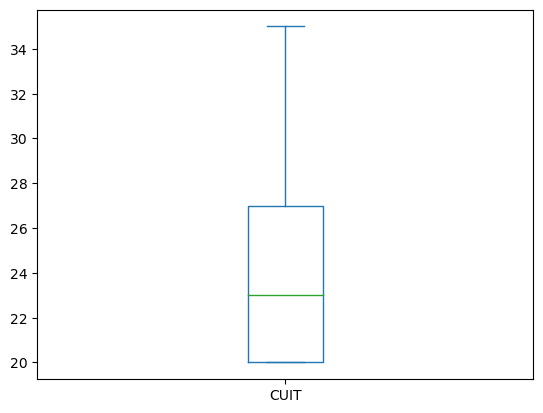

# Reporte AFIP

## por Julieta Bernaus

### Consideraciones generales

#### Tratamiento de datos

La base de datos contenía poco más de 6 millones de entradas. De esos, un 7.13% contenía valores que no se correspondían con los valores indicados por la [tabla de referencia de AFIP](https://www.afip.gob.ar/genericos/cInscripcion/archivoCompleto.asp). 

Esas filas fueron suprimidas para este análisis.

#### Herramientas

Se utilizó un programa propio en C++ para transformar la base de datos de un .txt a un .csv que se puede procesar con sistemas de gestión de bases de datos tradicionales. El tamaño de la base de datos (6 millones de filas) es problemático, ya que no se puede visualizar en Excel y es demasiado grande para otros programas como Tableau, con las limitaciones de mi hardware actual.

Para el análisis de los datos, se utilizó Python; específicamente, Pandas.

### Conclusiones

#### CUIT

La base de datos está compuesta por personas físicas y jurídicas, es decir, con CUITs que comienzan con 2 para las primeras y 3 para las segundas. Originalmente, la mayoría de las personas físicas obtenían un CUIT con comienzo 20 si su género era masculino y 27 si era femenino, por lo cual esos son los comienzos más populares. 

Las personas físicas componen la gran mayoría. En el , se puede observar la alta concentración de las personas en el rango de los 20-x, en especial en 20 millones. Se puede suponer entonces que la mayoría de los inscriptos son hombres.

#### Impuesto a las ganancias

La mayoría de los contribuyentes tienen categoría "No Inscripto" dentro de "IMP GANANCIAS", significando que no están afectados por el impuesto a las ganancias. Estos son más de 4 millones dentro de menos de 6 millones de contribuyentes listados, o aproximadamente el 73,9% de la base de datos. Además, hay otro 1% entre personas jurídicas exentas y a quienes no les corresponde ese tributo.

#### Impuesto IVA

Asimismo, la mayoría de los contribuyentes no está inscripto para el impuesto IVA tampoco, en cantidades aún mayores, el 77%. Sumado a las exenciones y a los no alcanzados, se trata de un 81,6% fuera de la categoría activa.

#### Monotributo

En cuanto al monotributo, la categoría más frecuente es la A, conteniendo al 30% de los contribuyentes. Por el contrario, las categorías I, J y K juntas concentran a un 0,17% entre las tres.

#### Sociedades y Empleadores

El 100% de los contribuyentes con todos los campos correctamente completados no son miembros de sociedades. Esto podría deberse a un error en la tabla proporcionada por la AFIP, en la que aquellos que sí lo son tienen campos incompletos o con valores que escapan aquellos que se supone que pueden tomar. Sin embargo, incluso antes de limpiar los datos, menos del 2% de las entradas tenían un valor distinto a "NO" para esta categoría.

Por otro lado, el 91,2% de la base no está considerada como empleador, con una minoría que sí lo es.

#### CUIT e interrelaciones

Agrupando a los contribuyentes por el comienzo del CUIT y realizando un análisis estadístico de la varianza versus el CUIT, se puede ver que existe una gran diferencia entre qué tipos de personas son más frecuentes para cada categoría de Ganancias (NI/AC/EX/NC). Sin embargo, esto se debe a que EX y NC se utilizan solo para personas jurídicas. 

Tabla 1: 
**EMPLEADOR**|**CUIT**|**CANTIDAD**
:-----:|:-----: | :-----:
N|2...|2805164
N|3...|2239912
S|2...|186841
S|3...|359811

En la tabla 1 se puede apreciar cómo solo el 6,2% de las personas físicas son empleadores, mientras que eso representa el 13,8% para las jurídicas, más del doble.

Mediante el análisis de Cramér-V corregido, se puede determinar que no hay relaciones muy fuertes entre cualquier par de: monotributo, impuesto a las ganancias, IVA. Mediante un análisis más segmentado, podría descubrirse alguna, pero el índice de correlación está entre 0,45 y 0,55 para todas esas combinaciones.